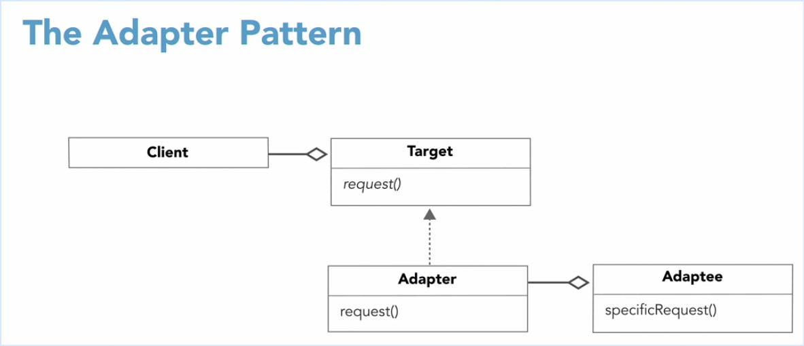

# Adapter Design Pattern

--------------------------------


```
This pattern converts the interface of a class into another interface that clients expect. 
It allows classes to work together that couldn't otherwise because of incompatible interfaces.
```



Adapter pattern is similar to the real world adapters we use,
Consider we have USB to Ethernet adapter or COM to Serial port.

Adapter is required when we have an Ethernet interface on one end and USB on the other.
Since they are incompatible with each other.
This example is pretty analogous to Object Oriented Adapters.
In design, adapters are used when we have a class (Client) expecting some type of object and we have an object (Adaptee aka receiver) 
offering the same features but exposing a different interface.


## To use an adapter:
The client makes a request to the adapter by calling a method on it using the target interface.
The adapter translates that request on the receiver(aka adaptee) using the adaptee interface.
Client receive the results of the call and is unaware of adapter’s presence.

### Definition:
An Adapter pattern acts as a connector between two incompatible interfaces that otherwise cannot be connected directly.
An Adapter wraps an existing class with a new interface so that it becomes compatible with the client’s interface.

#### Advantages
1. Helps achieve re-usability and flexibility.
2. Client class is not complicated by having to use a different interface and can use polymorphism to swap between different implementations of adapters.
#### Disadvantages
1.All requests are forwarded, so there is a slight increase in the overhead.
2.Sometimes many adaptations are required along an adapter chain to reach the type which is required.


### Example
MediaPlayer, which can play MP3, OGG audio files.
the same MediaPlayer also need to support M4A, VLC playlist type format.

Since MP3 & OGG is audio codec format file and M4A or VLC will be audio playlist.

To Enable support for the playlist, we are going to use Adapter to enable the support.


